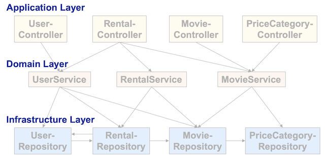

# Lektion 6: "Controller" Design Pattern

In dieser Lektion werden wir den *Application Layer* (siehe Abbildung 1) unserer *movierental* Enterprise Applikation genauer diskutieren. Dieser  *Application Layer* beinhaltet die verschiedenen Controller Komponenten.  Dabei bildet das [Spring MVC](https://docs.spring.io/spring/docs/current/spring-framework-reference/web.html#mvc) die Basis, um diese Controller Komponenten als Spring Beans zu implementieren und um Features des Spring Frameworks wie *Dependency Injection* nutzen zu können.

Abbildung 1: Layered Architecture mit *Application Layer*

## Arbeitsauftrag
Zur Vorbereitung und Erarbeitung der Theorie lesen sie sich in das aktuelle Thema ein, mit der  [Einführung](#einführung) und den Folien:

* [druckbare Version](https://fhnw365.sharepoint.com/teams/eaf_M365/Freigegebene%20Dokumente/hs21/06/SpringMVC.pdf?CT=1634370442021&OR=ItemsView)
* [vertonte Version](https://fhnw365.sharepoint.com/teams/eaf_M365/Freigegebene%20Dokumente/hs21/06/SpringMVC-audio.mp4)

Die Theorie vertiefen sie mit folgenden Arbeitsblätter:

* [Arbeitsblatt AB6.1](https://fhnw365.sharepoint.com/teams/eaf_M365/Freigegebene%20Dokumente/hs21/06/AB6_1.pdf?CT=1634370486088&OR=ItemsView) In dieser Aufgabe nutzen sie OpenAPI Spezifikation, um ihre Server Applikation zu visualisieren und zu dokumenieren.
* [Arbeitsblatt AB6.2](https://fhnw365.sharepoint.com/teams/eaf_M365/Freigegebene%20Dokumente/hs21/06/AB6_2.pdf?CT=1634370538249&OR=ItemsView)  In dieser Aufgabe erweitern sie die Controller aus AB6.1, so dass schlussendlich Level 2 des [Richardson Maturity Model](https://martinfowler.com/articles/richardsonMaturityModel.html) implementiert ist.

## Einführung
Auch in dieser und den weiteren Lektionen wird das [Spring Framework](https://spring.io/projects/spring-framework) mit [Spring MVC](https://docs.spring.io/spring/docs/current/spring-framework-reference/web.html#mvc) und [Spring Boot](https://spring.io/projects/spring-boot) intensiv eingesetzt. Diese Technologien werden für den Rest des Moduls unsere Basis bilden, um _Java Enterprisee Applications_ mit _RESTful API_ schnell und effizient implementieren zu können. Es ist deshalb wichtig, dass ihr mit diesen Technologien vertraut seid. Die Technologien basieren auf dem _Servlet API_ und nutzen die Basiskomponenten _Servlet_, _Filter_, _Listener_. Diese Basiskomponenten werden aber ausschliesslich vom Spring Framework verwendet. Dem Entwickler steht schlussendlich eine Umgebung in Form des *Spring Container* mit all seinen Features zur Verfügung, welche das *Servlet API* komplett abstrahiert.

Da Enterprise Applikationen oft als *RESTful Webservice* mit einem entsprechenden API implementiert werden, ist es für den Entwickler wichtig, dass er den gesamten Pfad eines HTTP-Requests zum Endpoint und der entsprechenden Response kennt und versteht wie die verschiedenen Komponemten einer Enterprise Applikation den Request und Response verarbeiten.

Auch in diesem EA-Kontext hat man diverse Design Patterns als *Best Practices* formuliert. Hier ein paar Links zu den verschiedenen Design Patterns auf der Website von [Martin Fowler](https://www.thoughtworks.com/de/profiles/martin-fowler). Wichtig für uns sind folgende:

* [Model View Controller](https://martinfowler.com/eaaCatalog/modelViewController.html)
* [Front Controller](https://martinfowler.com/eaaCatalog/frontController.html)
* [Page Controller](https://martinfowler.com/eaaCatalog/pageController.html)
* [Richardson Maturity Model](https://martinfowler.com/articles/richardsonMaturityModel.html#TheMeaningOfTheLevels) mit Referenz auf einen [Talk](https://www.crummy.com/writing/speaking/2008-QCon/act3.html) von Richardson 

Wichtig ist, dass sie diese Patterns zu den Komponenten von [Spring MVC](https://docs.spring.io/spring/docs/current/spring-framework-reference/web.html#mvc) zuordnen können und dass sie die Funktionsweise verstehen und erklären können, so dass sie schlussendlich eine Antwort auf folgende Fragen geben können:

* Welche Rolle spielt das [DispatcherServlet](https://docs.spring.io/spring/docs/current/spring-framework-reference/web.html#mvc-servlet)? Wann wird es gestartet? Wie wird es gestartet?
* Welches sind die Page Controller? Wie und warum werden sie gestartet?
* Ist ein Page Controller bei Spring MVC ein Servlet?
* Wieviele Servlets gibt es in einer Spring MVC Applikation
* Was ist der Endpoint für einen HTTP Request bei einer Spring MVC Applikation?
* Welche Rollen spielen in einer Spring MVC Applikation:
    * Web Server?
    * Servlet Container?
    * Spring Container?