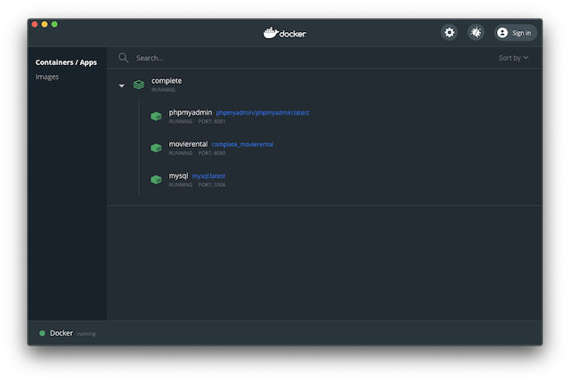

# Lektion 7: Containerisierung von Enterprise Application

In dieser Lektion wollen wir unsere *movierental* Enterprise Applikation für den Einsatz in einem *produktiven Umfeld* ausbauen. Für diesen Ausbau werden wir folgende Schritte ausführen:  
* *Aussagekräftiges Logging* einführen, um das Laufzeitverhalten nachverfolgen zu können.
* *Externe Datenbank* nutzen, so dass die persistierten Daten einen Restart der Applikation überleben können.
* *Containerisierung nutzen*, um die verschiedenen Server-Komponenten mit einer einheitlichen Laufzeitumgebung bereitstellen zu können.

Ziel ist es, dass die gesamte Applikation über Docker verwaltet werden kann (siehe Abbildung 1).



Abbildung 1: Docker Dashboard auf einem Mac mit den Container für `MySQL`, `phpMyAdmin`, `movierental.jpa`

## Arbeitsauftrag
Zur Vorbereitung und Erarbeitung der Theorie lesen sie sich in das aktuelle Thema ein, mit der  Einführung und den Folien:

* [druckbare Version](https://fhnw365.sharepoint.com/teams/eaf_M365/Freigegebene%20Dokumente/hs21/07/Docker.pdf?CT=1635425598005&OR=ItemsView)
* [vertonte Version](https://fhnw365.sharepoint.com/teams/eaf_M365/Freigegebene%20Dokumente/hs21/07/Docker-audio.mp4)

Die Theorie vertiefen sie mit folgenden Arbeitsblättern:

* [Arbeitsblatt AB7.1](https://fhnw365.sharepoint.com/teams/eaf_M365/Freigegebene%20Dokumente/hs21/07/AB7.1.pdf?CT=1635425531728&OR=ItemsView)<br/>
  Ein aussagekräftiges Logging ist für das Verständnis des Laufzeitverhaltens einer Enterprise Applikation sehr wichtig. Sie werden in diesem Arbeitsblatt ein solches Logging implementieren.
* [Arbeitsblatt AB7.2](https://fhnw365.sharepoint.com/teams/eaf_M365/Freigegebene%20Dokumente/hs21/07/AB7.2.pdf?CT=1635425556875&OR=ItemsView)<br/>
  In diesem Arbeitsblatt werden sie *existierende Docker Images nutzen*, um [MySQL](https://www.mysql.com) und [phpMyAdmin](https://www.phpmyadmin.net/) auf ihrem Computer zu installieren. Dabei werden sie das `docker` Tool nutzen, um `MySQL` und `pypMyAdmin` von [Docker Hub](https://hub.docker.com/) zu laden und als Docker Container zu starten.
* [Arbeitsblatt AB7.3](https://fhnw365.sharepoint.com/teams/eaf_M365/Freigegebene%20Dokumente/hs21/07/AB7.3.pdf?CT=1635425573640&OR=ItemsView)<br/>
  Das Video [ab7.3](https://fhnw365.sharepoint.com/teams/eaf_M365/Freigegebene%20Dokumente/hs21/07/ab7.3.mp4) zeigt, wie die aktuelle Version unsere Enterprise Applikation mit `docker-compose` genutzt werden kann. Das Video muss heruntergeladen werden!

  In diesem Arbeitsblatt wird der Umgang mit Docker vertieft, indem sie:
    1. für die Enterprise Applikation `movierental.jpa` ein eigenes Docker Image erstellen.
    2. `docker-compose` nutzen, um die einzelnen Komponenten als Docker-Services zu definieren und gleichzeitig alle Komponenten der Enterprise Applikation als Docker Container zu starten. Die Komponenten sind die Datenbank `MySQL`, das DB-Administrationstool `phpMyAdmin` und den Webservice `movierental.jpa`.

        Für einen Einstieg in `docker-compose` können sie folgende Ressourcen nutzen:
        * [Docker Tutorial](https://www.youtube.com/watch?v=i7ABlHngi1Q) von 30min - 40min
        * [Overview of Docker Compose](https://docs.docker.com/compose/)

## Einführung
Eine Einführung in Docker erhält man mit [Docker for beginners](https://docker-curriculum.com/#introduction). Dabei sind die folgende Kapitel sinnvoll für den Einstieg:
* [Introduction](https://docker-curriculum.com/#introduction)
* [Getting Started](https://docker-curriculum.com/#getting-started)
* [Hello World](https://docker-curriculum.com/#hello-world)

Für die Kommunikation zwischen den Container zu ermöglichen, ist es wichtig ein Verständnis für das *Networking* zu erarbeiten. Es stellt sich z.B. die Frage was `localhost` innerhalb eines Containers ist! Vor allem am Anfang ist *Docker Networking* komplex, um die einzelnen Container korrekt in ein gemeinsames Netzwerk einzubinden. Man muss z.B. folgenden Befehl absetzen, um das Image `movierental` als Container `server` in das Netzwerk `completed_default` einzubinden:

```shell
$ docker run -p 8080:8080 --env SPRING_PROFILES_ACTIVE=prod \
  --env SPRING_DATASOURCE_URL='jdbc:mysql://mysql:3306/eaf?useSSL=false' --name=server \
  --network=completed_default movierental
```

Mit `docker-compose` wird das einfacher. Mehr zum Thema *Networking* finden sie unter:
* [Container networking](https://docs.docker.com/config/containers/container-networking/)


Spring stellt 2 Guides zur Verfügung, die Spring Boot und Docker behandeln:
* Getting Started Guide [Spring Boot with Docker](https://spring.io/guides/gs/spring-boot-docker/) (15-30min)
* Topical Guide [Spring Boot Docker](https://spring.io/guides/topicals/spring-boot-docker/) (ca. 60min)

Sie sollen in dieser Lektion über das praktische Arbeiten ein Verständnis für die Containerisierung mit Docker aufbauen und die Konzepte hinter den folgenden Begriffen im Kontext von Docker verstehen:

* **Virtualisierung**: Wie unterscheidet sich die *Virtualisierung* gegenüber einer virtuellen Maschine?
* **Dockerfile**: Was ist ein *Dockerfile*?
* **Layer**: Was ist ein *Layer*?
* **Image**: Was ist ein *Image*? Welcher Zusammenhang besteht mit dem *Layer*? Was kann man mit ein *Image* machen?
* **Container**: Was ist ein *Container*? Welcher Zusammenhang besteht mit dem *Image*?
* **Networking**: Wie funktioniert das *Networking* bei Docker Compose?
